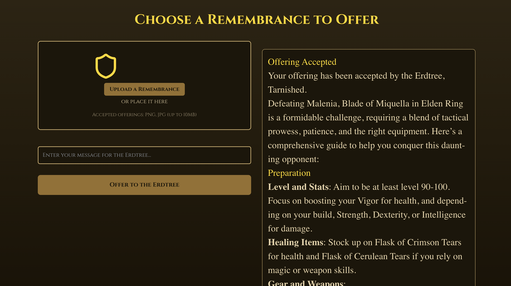

# EldenForge


## Environment Setup

This project uses a Conda environment. To recreate the environment, follow these steps:

1. Ensure you have Conda installed on your system.
2. Clone this repository:
   ```
   git clone https://github.com/SND96/EldenForge.git
   cd EldenForge
   ```
3. Create the Conda environment from the `environment.yml` file:
   ```
   conda env create -f environment.yml
   ```
4. Activate the environment:
   ```
   conda activate elden-forge-env
   ```

### Creating the .env file

1. In the root directory of your project, create a file named `.env`.
2. Add the following content to the file:

```
OPENAI_API_KEY=<your_openai_api_key>
COHERE_API_KEY=<your_cohere_api_key>
```

Replace `<your_openai_api_key>` and `<your_cohere_api_key>` with your actual API keys.

### Front-end
```
cd elden-ring-app
npm install
npm run start
```

### Back-end
```
cd elden-ring-backend
npm install express cors multer
node server.js
``` 

### Database
```
cd elden-ring-rag
python server_launcher/launch_server.py
```

Go to `http://localhost:3000/` to see the app.


## App Screenshot


